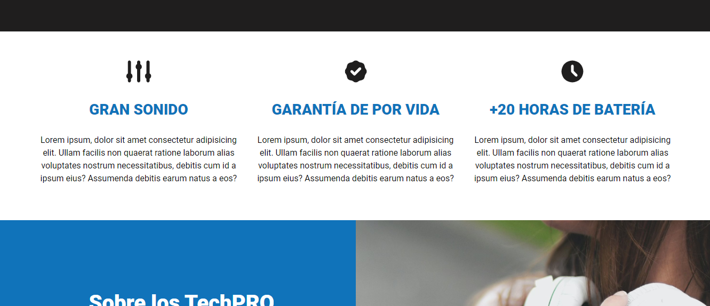
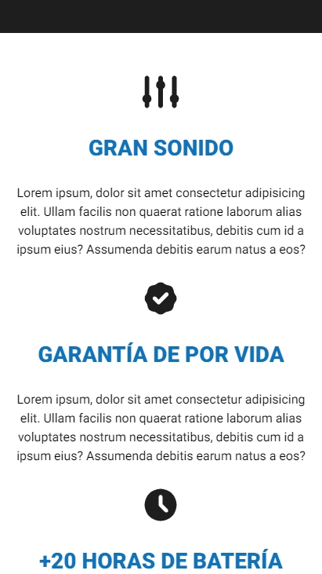

# Proyecto HTML / CSS TechPro

## Información

-Diseñar una página web con HTML desde cero responsive.  
-Dar estilo con Css utilizado distintas variables (Grid, FelxBox, MediaQuery) 
-Mejorar el rendimiento utilizando imágenes .avif, .webp, .jpg (dependiendo de cuales navegadores soporten cada formato) 
-NOTA: Este es el segundo proyecto de HTML / CSS
  

## Web

    
    
    
    

 

## Phone
  

      
         
      
      
  

  ## Link:  https://segundoproyectotechpro.netlify.app